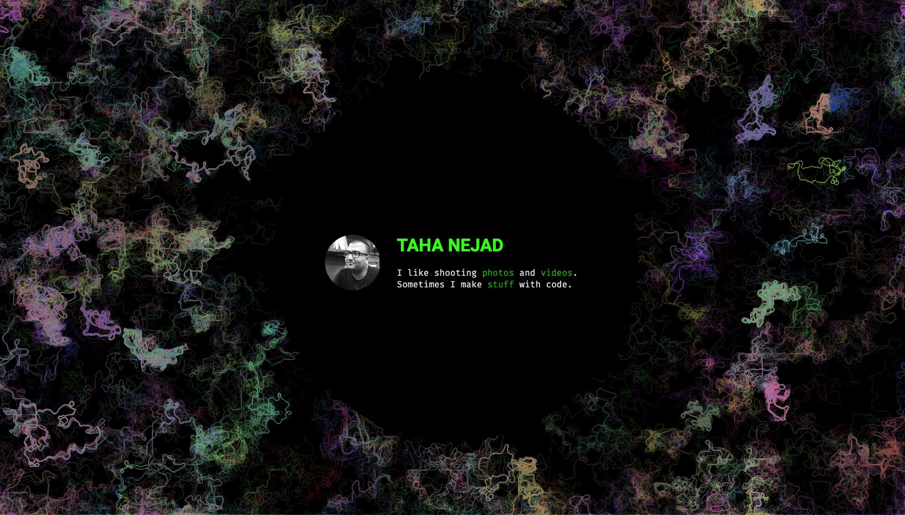

# TAHA NEJAD

My Personal Website. [tahanejad.com](https://www.tahanejad.com)

I'm working on this website as a sandbox for Front-End Development.

## V1.0 Spring 2024 :white_check_mark:

A simple HTML + CSS page with basic info.

## V1.5 Spring 2024 :white_check_mark:

Added a generative flow field (p5.js sketch) as the background of the webpage.

## V2.0 Coming Soon (Summer 2024)

Add an Interactive GUI that controls the parameters of the flow feild. 

---
This repo also includes code from other libraries:
- [p5.js](https://github.com/processing/p5.js) is licensed under LGPL 2.1
